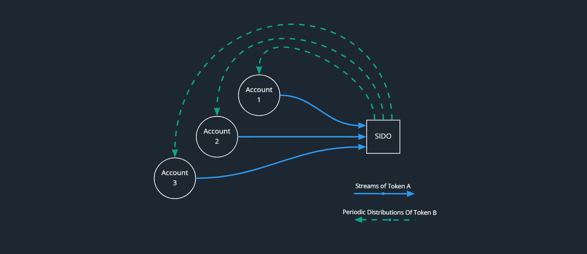
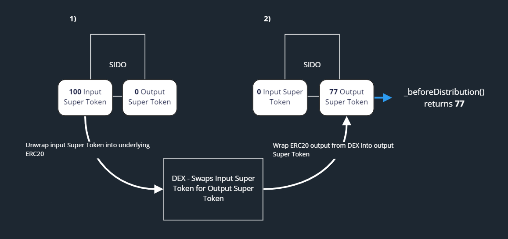

# Stream In Distribute Out

This example project focuses the use case of streaming into a Super App contract
in exchange for shares of an index. 

This provides a way for a smart contract to accept streams of a certain input Super Token from any number of accounts and instantly distribute another output Super Token back to those accounts in proportion to the size of their streams.



## Installation

In this directory, run the following depending on your node package manager.

```bash
# yarn
yarn

# npm
npm i
```

## Stream In Distribute Out

The [base contract](./contracts/base/StreamInDistributeOut.sol) features a
minimal template from which developers may derive their own contracts. To use this base contract, import it and inherit it. 

This exposes a few super app callbacks to handle a stream's creation, update, and deletion. The callbacks make sure an account streaming to the contract is given IDA units (distribution shares) equal to their flow rate and call the internal `executeActionInCallback` function.

There is also a public `executeAction` function, can be called by off-chain scripts
at a regular interval. 

Two super token addresses are declared in this base
contract as well, the `_inToken` and the `_outToken`. The input token is the Super Token to stream into the contract and the output token is the Super Token that gets
distributed to streaming accounts when an action is executed. Note that these can be the
same token if necessary.

All callbacks, as well as `executeAction` will trigger an internal function
before the distribution. This function, `_beforeDistribution`, is where any
actions may be taken before the distribution of the output token. Any derived
contracts should override this internal function with their own unique logic.

This `_beforeDistribution` function _must_ return a `uint256` amount to be
distributed to the streamers after its completion.

Examples of what can be done before distribution is the following.

-   Swap `_inToken` for `_outToken` on an exchage and return the amount swapped (dollar-cost averaging)
-   Execute a flash loan and return the flash fee
-   Deposit liquidity into a single-asset pool and return the amount of LP tokens

## Stream Swap Distribute

This [contract](./contracts/StreamSwapDistribute.sol) showcases how a contract
deriving `StreamInDistributeOut.sol` might look.

Notice there are two key things that the deriving contract must do. First is to
add the `StreamInDistributeOut()` to the constructor, passing the Superfluid
host address, Constant Flow Agreement address, Instant Distribution Agreement
address, the input token, and the output token (). Second is to override the
`_beforeDistribution` function that returns the amount for distribution.

In this contract, we do a few things inside of the `_beforeDistribution`
function.

-   Downgrade input token to its underlying ERC20 token
-   Swaps the full balance of the underlying ERC20 of the input token for the
    underlying ERC20 of the output token
-   Upgrades the full balance of the underlying ERC20 of the output token
-   Returns the full upgraded amount of the output token to be distributed.

Here is a visualization of those steps: 



**NOTICE**: This is **not** yet suitable for production. The function call
`swapExactTokensForTokens` to the Uniswap V2 router specifies a `0` minimum
output, opening the swap to front running and sandwich attacks. This contract
is for demonstration purposes **only**, and developers should be mindful when
creating a contract that interacts with exchanges.
